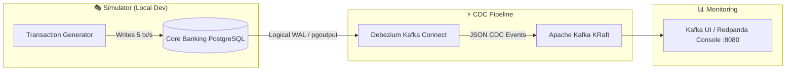

# Banking CDC Streaming Platform

[](https://github.com/TrNhDuong/Banking-Streaming/actions/workflows/ci.yml)

An enterprise-ready Change Data Capture (CDC) streaming pipeline for banking transactions, powered by **PostgreSQL**, **Debezium**, and **Apache Kafka**.



---

## Tech Stack

- **Source Database**: PostgreSQL 16 (Logical Replication + `pgoutput` plugin)
- **CDC Engine**: Debezium 3.5.2 (via Kafka Connect)
- **Message Broker**: Apache Kafka 4.1.2 (KRaft mode — Zookeeper-less)
- **Monitoring Web UI**: Redpanda Console (Kafka UI)
- **Environment Simulator**: Synthetic Vietnamese banking transactions generator (`vi_VN` locale)
- **Tooling**: Python 3.12 CLI operator with structured logging

---

## Repository Structure

```text
Banking Streaming/
├── cli/              # 🛠️ Platform Operator CLI (compose, cdc, connector, logger)
├── deploy/           # 🚀 Production deployment artifacts (Dockerfile, compose.prod, guide)
├── docs/             # 📚 Comprehensive documentation hub (architecture, CDC specs, guides)
├── infra/            # 🐳 Modular Docker Compose configurations for local dev
├── simulator/        # 🎭 Mock Core Banking environment (DB schema + Generator)
│   ├── database/     # Banking DDL schema (customers, accounts, merchants, transactions)
│   └── generator/    # Transaction generator daemon (seed + real-time transfer stream)
├── tests/            # 🧪 Unit test suite (81 tests, 100% offline via pytest)
├── manage.py         # ⚡ Single entrypoint CLI runner
├── requirements.txt  # 📦 Python project dependencies
├── pytest.ini        # ⚙️ Pytest configuration
└── README.md
```

---

## Documentation

Full architectural and operational guides are available in the **[docs/](docs/README.md)** directory:

- 📐 **[System Architecture & CDC Mechanics](docs/architecture.md)** — WAL replication, pgoutput, and streaming topology.
- 🚀 **[Getting Started Guide](docs/getting-started.md)** — Step-by-step local setup, 1-click launch, and healthchecks.
- 📋 **[CDC Event Specification](docs/cdc-event-specification.md)** — Debezium JSON envelope, operations (`c`/`u`/`d`/`r`), and schema anatomy.
- 🏭 **[Production Deployment](docs/production-deployment.md)** — Zero-Trust DBA workflow, container registry, ECS/K8s guide.
- 💻 **[CLI Reference Manual](docs/cli-reference.md)** — All `manage.py` commands, flags, and environment variables.

---

## Quickstart (Local Development)

### 1. Prerequisites
- Docker & Docker Compose v2.20+
- Python 3.12+

### 2. Setup Environment
```bash
# Install dependencies
python -m pip install -r requirements.txt

# Copy local environment template
cp .env.local.example .env.local
# (On Windows PowerShell: Copy-Item .env.local.example .env.local)
```

### 3. Start the Platform
```bash
# 1-Click Launch: Starts Postgres, Kafka, Connect, applies CDC, and starts Generator
python manage.py --env-file .env.local local up
```

### 4. Monitor & Inspect
Open your browser to:
```text
http://localhost:8080
```
Inspect real-time CDC streams in topics:
- `banking.public.transactions`
- `banking.public.accounts`
- `banking.public.customers`
- `banking.public.merchants`

---

## CLI Reference (`manage.py`)

| Command | Description |
| :--- | :--- |
| `python manage.py local up` | Start full local stack + setup CDC + apply connector |
| `python manage.py local status` | Show status of running containers |
| `python manage.py local down` | Stop all local containers |
| `python manage.py local reset` | Destroy containers and purge persistent data volumes |
| `python manage.py cdc verify` | Verify WAL level, publications, and replication slots |
| `python manage.py cdc render` | Render DBA SQL prerequisite script (for production review) |
| `python manage.py connector apply` | Deploy or update Debezium connector via Connect REST API |
| `python manage.py connector status` | Fetch connector health and task status |
| `python manage.py connector delete` | Remove connector from Kafka Connect |

Add `-v` or `--verbose` to any command for detailed debug logging:
```bash
python manage.py -v local status
```

---

## Production Deployment

For deploying to production (AWS RDS, MSK, EKS, ECS, or bare-metal VMs), see the step-by-step guide in:

👉 **[deploy/README.md](file:///c:/Users/MY%20MSI/Desktop/Project/Data%20Engineer/Banking%20Streaming/deploy/README.md)**

---

## Running Tests

Unit tests run completely offline and do not require Docker:

```bash
python -m pytest
```
