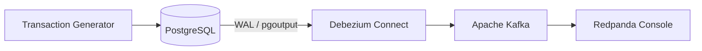

# Banking CDC Streaming Platform

[](https://github.com/TrNhDuong/Banking-Streaming/actions/workflows/ci.yml)

A CDC streaming pipeline for banking transactions using **PostgreSQL**, **Debezium**, and **Apache Kafka**.



## Tech Stack

* **PostgreSQL 16** — source database
* **Debezium 3.5.2** — CDC
* **Apache Kafka 4.1.2** — KRaft mode
* **Redpanda Console** — Kafka monitoring
* **Python 3.12** — CLI and transaction simulator
* **Docker Compose** — local infrastructure
* **pytest** — unit testing

---

## Repository Structure

```text
Banking-Streaming/
├── cli/            # Platform CLI
├── deploy/         # Production deployment
├── docs/           # Architecture and operation guides
├── infra/          # Docker Compose configuration
├── simulator/
│   ├── database/   # Banking schema
│   └── generator/  # Synthetic transaction generator
├── tests/
├── manage.py
├── requirements.txt
└── README.md
```

---

## Quick Start

### Requirements

* Docker + Docker Compose
* Python 3.12+

Install dependencies:

```bash
python -m pip install -r requirements.txt
```

Create local environment:

```bash
cp .env.local.example .env.local
```

Windows PowerShell:

```powershell
Copy-Item .env.local.example .env.local
```

Start the full platform:

```bash
python manage.py --env-file .env.local local up
```

This starts PostgreSQL, Kafka, Kafka Connect, configures CDC, and runs the transaction generator.

---

## Monitor CDC Events

Open:

```text
http://localhost:8080
```

Main Kafka topics:

```text
banking.public.transactions
banking.public.accounts
banking.public.customers
banking.public.merchants
```

---

## CLI

| Command                             | Description                         |
| ----------------------------------- | ----------------------------------- |
| `python manage.py local up`         | Start the local platform            |
| `python manage.py local status`     | Show service status                 |
| `python manage.py local down`       | Stop the platform                   |
| `python manage.py local reset`      | Remove containers and volumes       |
| `python manage.py cdc verify`       | Verify PostgreSQL CDC configuration |
| `python manage.py cdc render`       | Generate DBA prerequisite SQL       |
| `python manage.py connector apply`  | Create/update Debezium connector    |
| `python manage.py connector status` | Check connector status              |
| `python manage.py connector delete` | Delete connector                    |

Verbose logging:

```bash
python manage.py -v local status
```

---

## CDC Flow

```text
PostgreSQL
    │
    │ WAL
    ▼
Debezium
    │
    ▼
Kafka
    │
    ├── Fraud Detection
    ├── AML Processing
    ├── Analytics
    └── Data Warehouse
```

The simulator generates Vietnamese banking transactions and writes them directly to PostgreSQL. Debezium captures the database changes from WAL and publishes them to Kafka.

---

## Testing

Tests run offline without Docker:

```bash
python -m pytest
```

Current test suite: **81 tests**.

---

## Documentation

* [Architecture](docs/architecture.md)
* [Getting Started](docs/getting-started.md)
* [CDC Event Specification](docs/cdc-event-specification.md)
* [Production Deployment](docs/production-deployment.md)
* [CLI Reference](docs/cli-reference.md)

Production deployment notes are also available in [`deploy/README.md`](deploy/README.md).

---

## Project Scope

The project currently focuses on the CDC ingestion layer:

```text
PostgreSQL → Debezium → Kafka
```

Downstream systems such as fraud detection, AML pipelines, stream processing, and data warehouse ingestion can consume the Kafka topics independently.
