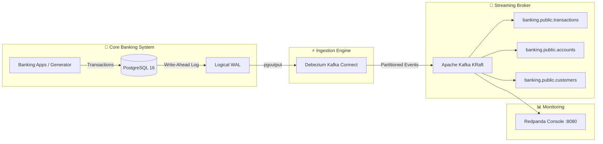

# Documentation Hub

Welcome to the **Banking CDC Streaming Platform** documentation. This directory provides comprehensive guides covering architecture, setup, CDC event schemas, production deployment, and CLI operations.

---

## Document Index

| Document | Description | Target Audience |
| :--- | :--- | :--- |
| **[Architecture & Data Flow](architecture.md)** | Core components, CDC mechanics, WAL replication, and infrastructure design. | Architects, Engineers |
| **[Getting Started](getting-started.md)** | Step-by-step guide to run and verify the platform locally in minutes. | Developers, Evaluators |
| **[CDC Event Specification](cdc-event-specification.md)** | Detailed breakdown of Debezium JSON payloads (`before`, `after`, `op`, `source`). | Data Engineers, Consumers |
| **[Production Deployment](production-deployment.md)** | Enterprise deployment guide: DBA approval workflow, Docker/ECS/K8s, and security. | DevOps, Platform Engineers |
| **[CLI Reference](cli-reference.md)** | Complete reference for `manage.py` commands, flags, and options. | Operators, Developers |

---

## High-Level Architecture Overview

---

## Quick Navigation

- Want to run the project right now? Head over to **[Getting Started](getting-started.md)**.
- Want to understand what the messages look like? Check **[CDC Event Specification](cdc-event-specification.md)**.
- Planning a production rollout? Read **[Production Deployment](production-deployment.md)**.
