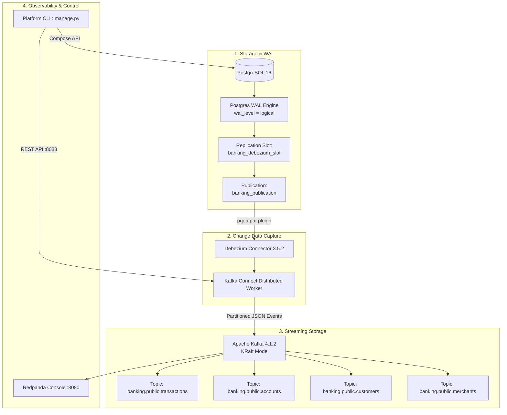

# System Architecture & CDC Mechanics

This document details the architectural blueprint of the **Banking CDC Streaming Platform**, explains the underlying Change Data Capture (CDC) mechanics, and highlights key design decisions.

---

## 1. System Components



### Component Breakdown

| Layer | Technology | Role |
| :--- | :--- | :--- |
| **Source Database** | PostgreSQL 16 | Primary relational database for transactions and customer data. |
| **CDC Engine** | Debezium 3.5.2 | Reads WAL logs directly using PostgreSQL `pgoutput` plugin. |
| **Connect Runtime** | Kafka Connect Distributed | Runs Debezium tasks, manages topic schemas and fault tolerance. |
| **Message Broker** | Apache Kafka 4.1.2 | Event log operating in KRaft mode (no Zookeeper required). |
| **Web Console** | Redpanda Console | Real-time browser UI for topic inspection, schema viewer, and lag monitoring. |
| **Simulator** | Python 3.12 + Faker | Synthetic data generator simulating high-volume transfers (`vi_VN` locale). |
| **Operator CLI** | Python 3.12 (`manage.py`) | Orchestrator for 1-click startup, CDC setup, and connector deployment. |

---

## 2. Why Log-Based CDC instead of Polling?

Traditional polling queries (`SELECT * FROM table WHERE updated_at > ?`) suffer from critical flaws in financial platforms:

```text
❌ Polling Queries:
   • High CPU/IO overhead on production database.
   • Cannot capture DELETE operations (hard deletes leave no updated_at).
   • Misses rapid intermediate state changes (e.g., PENDING -> PROCESSING -> SUCCESS within 50ms).

✅ Log-Based CDC (Debezium):
   • Zero database query overhead (reads binary Write-Ahead Log directly).
   • Captures 100% of mutations: INSERT (c), UPDATE (u), DELETE (d).
   • Preserves strict transactional ordering via Log Sequence Numbers (LSN).
   • Never locks tables or interferes with transactional ACID performance.
```

---

## 3. How Debezium Captures PostgreSQL Changes

1. **Logical Replication**: PostgreSQL writes every committed row change to the Write-Ahead Log (WAL). Setting `wal_level=logical` ensures row-level delta details are preserved.
2. **Replication Publication**: The SQL statement `CREATE PUBLICATION banking_publication FOR TABLE ...` defines exactly which tables are broadcasted.
3. **Replication Slot**: PostgreSQL maintains `banking_debezium_slot`. This slot guarantees that WAL segments are not deleted from disk until Debezium acknowledges reading them.
4. **pgoutput Plugin**: PostgreSQL's native logical decoding plugin formats WAL entries into structured byte streams without requiring third-party C extensions.
5. **JSON Envelope**: Debezium wraps each record into a standard event schema (`before`, `after`, `op`, `source`) and delivers it to Kafka.

---

## 4. Fault Tolerance & Data Consistency

- **At-Least-Once Delivery**: Offsets are committed back to Kafka's internal topic `banking_connect_offsets`. If a worker crashes, the replacement task resumes from the exact committed LSN.
- **Idempotency**: Downstream consumers can achieve exactly-once semantics by deduplicating against the unique composite key:
  `source.lsn` + `source.txId` + `payload.after.transaction_id`.
