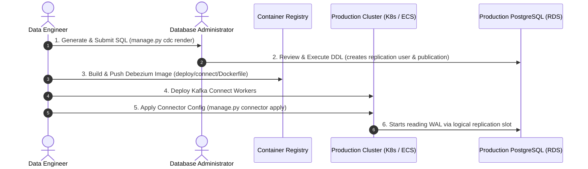

# Production Deployment Guide

This document outlines the enterprise deployment lifecycle for attaching the CDC streaming pipeline to an existing, production-grade Core Banking database.

---

## 1. Enterprise Deployment Workflow

In a production environment, Data Engineers **do not** have superuser access to the transactional database. The rollout follows a structured 4-phase workflow:



---

## 2. Step-by-Step Production Setup

### Step 1 — Generate DBA Prerequisite Script
Run the CLI tool in render-only mode using production parameters:

```bash
python manage.py --env-file .env.production cdc render > cdc_setup.sql
```

The resulting `cdc_setup.sql` script:
- Creates the `debezium` user with `REPLICATION` permissions.
- Grants read-only `SELECT` and `USAGE` privileges on the banking tables.
- Creates the `PUBLICATION` for the target tables.
- **Does not grant INSERT, UPDATE, or DROP permissions** (Principle of Least Privilege).

Submit this file to your DBA team for execution on your AWS RDS / Cloud SQL instance.

---

### Step 2 — Build & Push the Kafka Connect Image
The canonical production image lives in [deploy/connect/Dockerfile](file:///c:/Users/MY%20MSI/Desktop/Project/Data%20Engineer/Banking%20Streaming/deploy/connect/Dockerfile):

```bash
# Build
docker build -t banking-connect:latest deploy/connect/

# Tag & push to your private registry (ECR, GCR, Harbor)
docker tag banking-connect:latest <account_id>.dkr.ecr.<region>.amazonaws.com/banking-connect:3.5.2
docker push <account_id>.dkr.ecr.<region>.amazonaws.com/banking-connect:3.5.2
```

---

### Step 3 — Deploy Kafka Connect

#### Option A: Docker Compose on a Cloud VM (EC2 / Compute Engine)
Use the dedicated production compose file:

```bash
docker compose --env-file .env.production -f deploy/docker-compose.prod.yml up -d
```

#### Option B: AWS ECS / Fargate
Reference `deploy/connect/Dockerfile` as the container image and map environment variables from AWS Parameter Store / Secrets Manager.

#### Option C: Kubernetes (EKS / GKE)
Deploy as a standard Kubernetes `Deployment` with a `Service` exposing port `8083`. Configure `KAFKA_BOOTSTRAP_SERVERS` and database secrets via Kubernetes `Secret`.

---

### Step 4 — Register the Debezium Connector

Once Kafka Connect is running and reachable at `CONNECT_REST_URL`:

```bash
python manage.py --env-file .env.production connector apply
```

Verify that the connector and its tasks are running:

```bash
python manage.py --env-file .env.production connector status
```

---

## 3. Production Security Checklist

- [ ] **SSL / TLS**: `DB_SSLMODE` must be set to `require` or `verify-full` in `.env.production`.
- [ ] **Secret Management**: Passwords (`DB_PASSWORD`) should be injected via environment variables or secret mounts, never committed to Git.
- [ ] **Replication Slot Monitoring**: Monitor PostgreSQL metric `pg_replication_slots.active` and disk usage for WAL accumulation.
- [ ] **JVM Memory Settings**: On production workers, allocate JVM heap according to throughput:
  `JAVA_OPTS: "-Xms2g -Xmx4g"`.
- [ ] **Dead Letter Queue (DLQ)**: Ensure `ERRORS_DEADLETTERQUEUE_TOPIC_NAME` is configured to capture unparseable poison pills.
